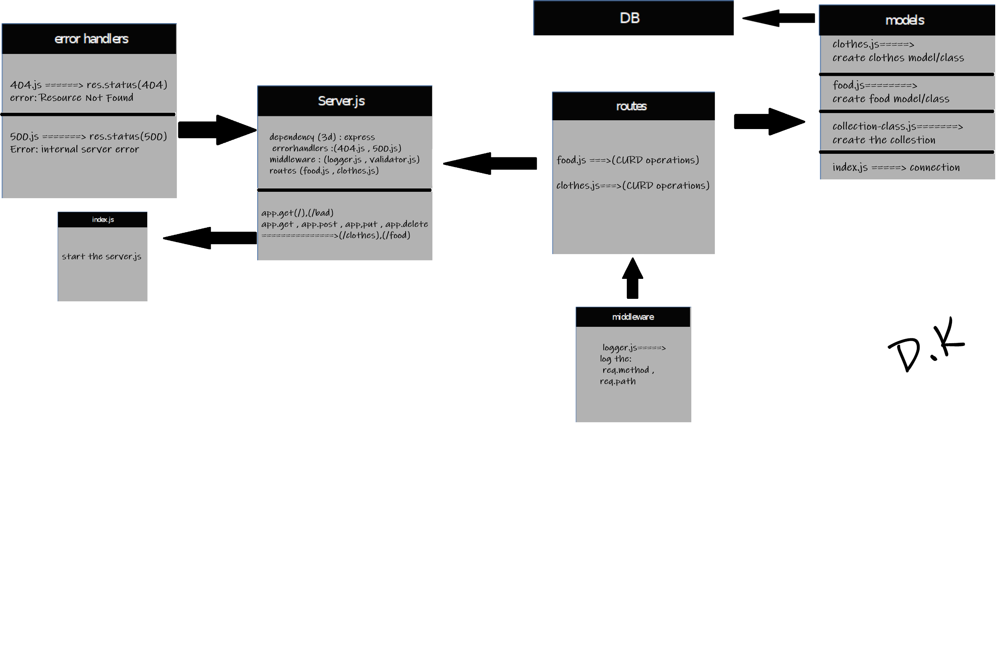

# api-server

## Author: Saleem Diab

## Links and Resources:
 ### Heroku:

* ### Github Actions:

* ### pull request :

## Setup 
### .env requirements :
* ### PORT=3000
* ### NODE_ENV=test

## Dependencies needs to install
* ### npm init -y
* ### npm i dotenv express cors 
* ### npm i -D jest supertest 
* ### npm i sequelize 
* ### npm i sqlite3
* ### npm i pg

## How to initialize/run your application (where applicable)

* ### nodemon
* ### node index.js
* ### npm start

 ## Test

### Run tests with :
 * ### npm run test

## UML/Application

